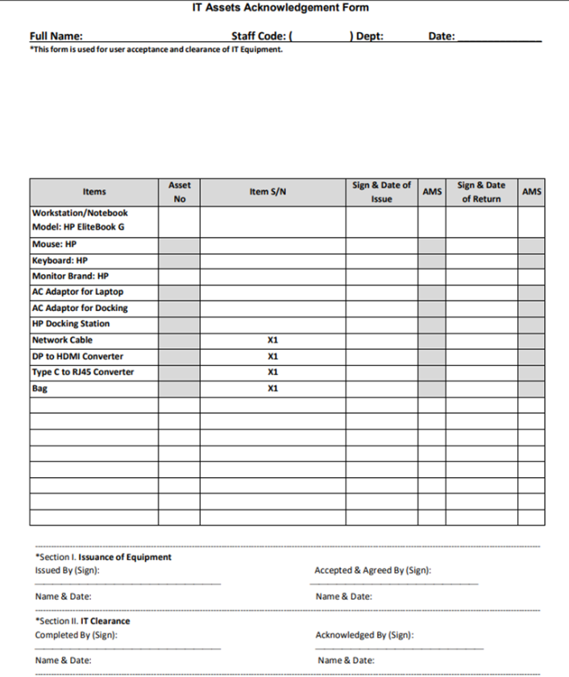
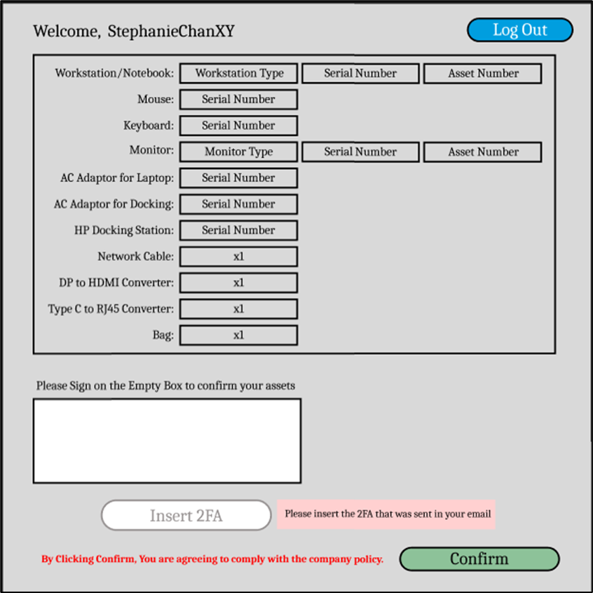

<html lang="en">
<head>
<meta charset="UTF-8">
<meta name="viewport" content="width=device-width, initial-scale=1.0">
<title>PROJECT 01</title>

</head>
<body>

  

    

      

      <h2 style="text-align: cemter">Initial Physical IT Asset Form</h2>
      

      
      
Above image is an example of a paper asset form. This asset form is used to keep track of assets that belong to its users. There are several disadvantages:

      
• Time-consuming and Labor-intensive

      
• Prone to Human Error

      
• Lack of Real-time Updates

      
• Difficulty in Sharing and Accessing Information

      
• Limited Security

      
• No Backup

      
• Space Constraints

      
• Inefficiency in Analysis and Reporting

      
• Environmental Impact

      
• Inability to Integrate

    

  

  

    

      

      
<h2>Digital Asset Form</h2>

      

      
      
Using PowerApps, I have transformed the paper and pen tracking asset system into digitalised method. This method uses sharepoint, making it easier to access, maintain and retrieve information. Technology is leveraged to enhance the product to a more transparent, secure and user-friendly system that meets the compliance requirements.

    

  

  

    

      

      
<h2>Flow & Process</h2>

      

      
<embed src="./docs/Project Proposal.pdf#toolbar=0&navpanes=0&scrollbar=0" type="application/pdf" width="400" height="250">

      
The comprehensive flow and process of our latest project through the embedded PDF above. This document meticulously outlines each step of our approach, from inception to completion, and delves into the key benefits that stem from innovative strategies. Gain insights into methodical procedures and the significant advantages they offer, providing a clear understanding of the project's value and efficiency. This detailed guide serves as a testament to our commitment to excellence and the impactful results.

    

  

</body>
</html>
